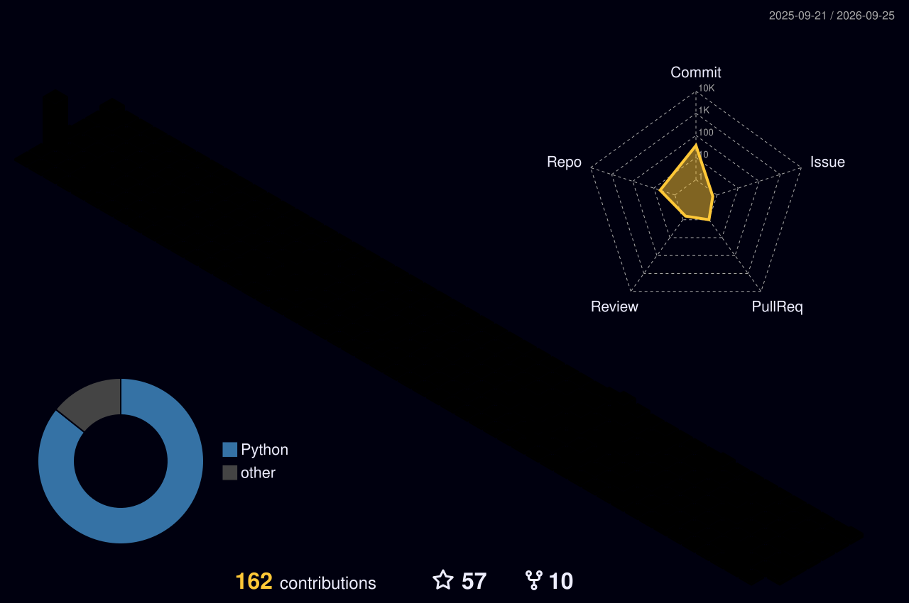

# 🎓 Seeking Ph.D. Opportunities — Fall 2027

**I am actively seeking fully funded Ph.D. positions for Fall 2027.**  
My interests include multi-agent systems, latent-space communication, autonomous evaluation, self-improving agents, and LLM post-training.

[📄 Research](https://xiaodu-flying.github.io/research.html) · [🌐 Website](https://xiaodu-flying.github.io/) · [✉️ Contact me](mailto:duzy@zju.edu.cn)

 

- 🙋 Hi! I am **Zhuoyun Du (杜卓耘)**, an M.Eng. student at the State Key Laboratory of CAD&CG, [Zhejiang University](https://www.zju.edu.cn/). I expect to graduate in 2027.
- 🔍 I am interested in **machine-native AI agents**, especially multi-agent collaboration, latent-space communication and reasoning, autonomous evaluation, recursive self-improvement, and LLM post-training.
- 🧪 My recent work includes [Interlat](https://arxiv.org/abs/2511.09149), [EvoPatient](https://arxiv.org/abs/2412.11716), and [Croto](https://arxiv.org/abs/2406.08979). I have also worked with the ByteDance Talent Program, Alibaba Future Living Lab, and THUNLP at Tsinghua University.
- 🎠 Outside research, I enjoy soccer, fencing, snowboarding, billiards, ballroom dancing, piano, photography, and physics.
- 📖 I share notes on my [personal blog](https://xiaodu-flying.notion.site/Welcome-to-my-blog-1d6df6af187d4b3ea1020fcc73aeec43?pvs=4) and longer research-oriented writing on my [website](https://xiaodu-flying.github.io/posts/).
- ✉️ Reach me at [duzy@zju.edu.cn](mailto:duzy@zju.edu.cn).
- 🫡 I am seeking **Ph.D. opportunities for Fall 2027** and welcome research internships and collaborations aligned with these interests.

<picture>
  <source media="(prefers-color-scheme: dark)" srcset="https://raw.githubusercontent.com/XiaoDu-flying/XiaoDu-flying/output/github-contribution-grid-snake-dark.svg">
  <source media="(prefers-color-scheme: light)" srcset="https://raw.githubusercontent.com/XiaoDu-flying/XiaoDu-flying/output/github-contribution-grid-snake.svg">
  
</picture>

