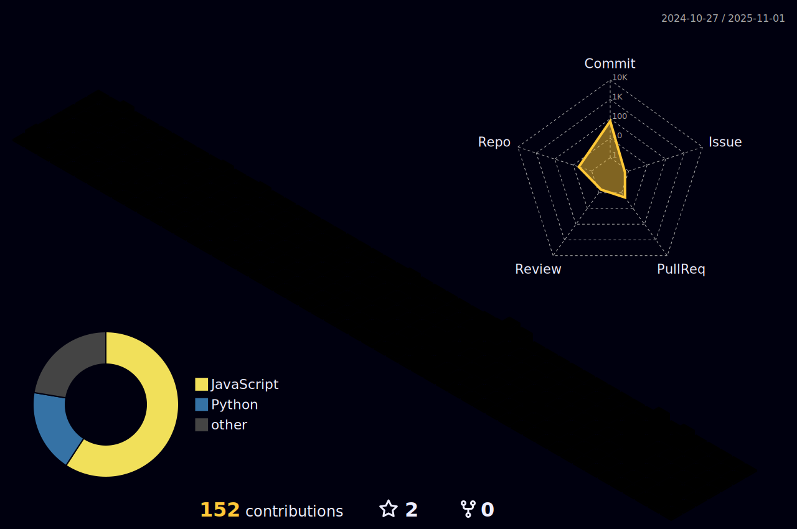

- 🙋My name is Zhuoyun Du (杜卓耘). I am a first-year graduate student from National Key Laboratory of CAD&CG, [Zhejiang University](https://www.zju.edu.cn/).
- 🔍My research interests encompass Artificial Intelligence, Natural Language Processing, Large Language Models, and Multi-agent Systems.
- 📖During my senior year of undergraduate studies, I served as a Research Assistant at THUNLP, [Tsinghua University](https://www.tsinghua.edu.cn).
- 🎠I have a passion for sharing blogs on my [blog site](https://xiaodu-flying.notion.site/Welcome-to-my-blog-1d6df6af187d4b3ea1020fcc73aeec43?pvs=4).
- ✉️Feel free to reach me at: [xiaodu.flying@gmail.com](xiaodu.flying@gmail.com).

<picture>
  <source media="(prefers-color-scheme: dark)" srcset="https://raw.githubusercontent.com/XiaoDu-flying/XiaoDu-flying/output/github-contribution-grid-snake-dark.svg">
  <source media="(prefers-color-scheme: light)" srcset="https://raw.githubusercontent.com/XiaoDu-flying/XiaoDu-flying/output/github-contribution-grid-snake.svg">
  
</picture>

